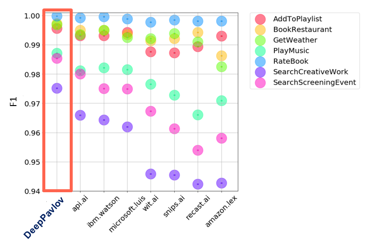

# Neural Networks for Intent Classifier

In this repo one can find code for training and infering intent classification
that is presented as _shallow-and-wide Convolutional Neural Network_[1].

#### Currently considered fasttext version in this repo does not works on Windows correctly.

Also this repo contains pre-trained model for intent classification on [SNIPS dataset](https://github.com/snipsco/nlu-benchmark/tree/master/2017-06-custom-intent-engines)

SNIPS dataset considers the following intents: `AddToPlaylist`, `BookRestaurant`, `GetWeather`, `PlayMusic`, `RateBook`, `SearchCreativeWork`, `SearchScreeningEvent`.



Test results for other intent recognition services are from https://www.slideshare.net/KonstantinSavenkov/nlu-intent-detection-benchmark-by-intento-august-2017


### How to install

First of all, one have to download this repo:

```
git clone https://github.com/deepmipt/intent_classifier.git

cd intent_classifier
```

The next step is to install requirements:

```
pip install -r requirements.txt
```


### How to use pre-trained model (SNIPS)

Now one is able to infer pre-trained model:

```
./intent_classifier.py ./snips_pretrained/snips_config.json
```

The script loads pre-trained model, if necessary downloads pre-trained fastText embedding model [2],
and then it is ready to predict class and probability of given phrase to belong with this class.

Example:
```
./intent_classifier.py ./snips_pretrained/snips_config.json
>I want you to add 'I love you, baby' to my playlist
>(0.99986315, 'AddToPlaylist')
```

### How to train on your own data

The repo contains  script `train.py` for training multilabel classifier.  
Training data file should be presented in the following `data.csv` form:

| request      |class_0|class_1|class_2|class_3| ...|
|------------- |:-----:|:-----:|:-----:|:-----:|:--:|
| text_0       | 1     | 0     | 0     |0      |... |
| text_1       | 0     | 0     | 1     |0      |... |
| text_2       | 0     | 1     | 0     |0      |... |
| text_3       | 1     | 0     | 0     |0      |... |
| ...          | ...   | ...   | ...   |...    |... ||

Then one is ready to run `train.py` that includes reading data, tokenization, constructing data, 
building dataset, initializing and training model with given parameters on dataset from `data.csv`:

```
./train.py config.json data.csv 
```

The model will be trained using parameters from `config.json` file. 
There is a description of several parameters:
 
- Directory named `model_path` should exist. 
For example, if `config.json` contains `"model_path": "./cnn_model"`, 
then configuration parameters for the trained model will be saved to `./cnn_model/cnn_model_opt.json` 
and weights of the model will be saved to `./cnn_model/cnn_model.h5`.

- Parameter `model_from_saved` means whether to load pre-trained model

- Parameter `lear_metrics` is a string that can include either metrics from `keras.metrics` 
or custom metrics from the file `metrics.py` (for example, `fmeasure`).

- Parameter `confident_threshold` is within the range `[0,1]` 
and means the boundary whether sample belongs to the class.

- Parameter `fasttext_model` contains path to pre-trained binary skipgram fastText [2] model for English language. 
If one prefers to use default model, it will be downloaded when one will train model.

- Parameter `text_size` means the number of words for padding of each tokenized text request.

- Parameter `model_name` contains name of the class method from `multiclass.ry` returning uncompiled Keras model.
One can use `cnn_model`  that is shallow-and-wide CNN (`config.json` contains parameters for this model),
`dcnn_model` that is deep CNN model (be attentive to provide necessary parameters for the model),
also it is possible to write  own model.

- All other parameters refer to learning and network configuration.

### How to infer

Infering can be done in two ways:
```
./infer.py config.json
```
or
```
./intent_classifier.py config.json
```

The first one runs `infer.py` file that contains reading parameters from `config.json` file, initializing tokenizer,
initializing and infering model. The second one is doing the same but reads samples from command line.


### References

[1] Kim Y. Convolutional neural networks for sentence classification //arXiv preprint arXiv:1408.5882. – 2014.

[2] P. Bojanowski*, E. Grave*, A. Joulin, T. Mikolov, Enriching Word Vectors with Subword Information.
